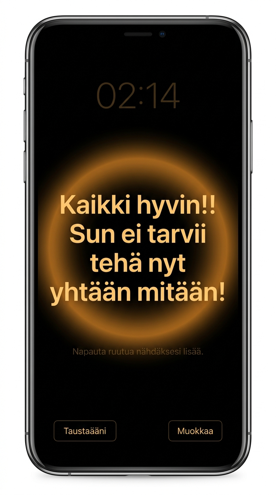

# Kaikki hyvin ("Everything is Fine")

A minimalist, premium night-time calm and reassurance Progressive Web App (PWA) designed to soothe sudden panic, anxiety, or confusional arousal episodes upon waking up in the middle of the night.

  
  

---

## Features

* **OLED-Black Design**: The entire background is pure black (`#000000`) to protect your eyes, emitting almost zero ambient light so it won't disturb your sleep.
* **Warm Amber Typography**: Large, soft text rendered in low-intensity warm amber/orange to limit blue-light exposure.
* **Ticking Digital Clock**: A very dim, low-contrast clock at the top of the viewport to quickly check the time without a blinding lock screen.
* **Soothing Breathing Guide**: A soft, glowing circle pulsing slowly (8-second cycles) to encourage calming, deep breathing.
* **Sound Synthesizer (Brown Noise)**: An offline-ready Web Audio API generator creating a low-pass muffled rumble (140Hz) to mask background noise.
* **Screen Wake Lock**: Automatically requests to keep your phone screen active while reading or breathing.
* **Smart Auto-Lock & Battery Protection**: Automatically monitors your battery level. If the battery falls below **15%**, it releases the screen wake lock and displays a peaceful warning, allowing the phone to naturally sleep and lock itself.
* **Fullscreen API Integration**: Tapping the screen to cycle reassurance messages automatically requests native browser fullscreen mode to hide any remaining browser search bars.
* **Instant Updates & Auto-Reload**: Uses a "Network-First" caching policy. The app loads the freshest version from the server immediately when you have an active network connection, and automatically reloads in the background to apply updates when they are pushed. It still retains offline access as a fallback.

## How to Use & Install on Your Phone

You can instantly use the app live by visiting: **[piisfulnait.vercel.app](https://piisfulnait.vercel.app/)**

To install it on your phone as a fullscreen, offline-capable **Progressive Web App (PWA)**:

### 1. On iOS (iPhone / iPad)
1. Open **[piisfulnait.vercel.app](https://piisfulnait.vercel.app/)** in **Safari**.
2. Tap the **Share** button (box with an arrow pointing up) in Safari's bottom toolbar.
3. Scroll down and select **"Add to Home Screen"** (*Lisää koti-valikkoon*).
4. Launch the app from your home screen icon.

### 2. On Android (Chrome / Edge)
1. Open **[piisfulnait.vercel.app](https://piisfulnait.vercel.app/)** in **Chrome** or **Edge**.
2. Tap **"Muokkaa"** (Edit) at the bottom right.
3. Under the **"Asenna sovelluksena"** section, tap **"Lataa kotinäyttöön"** (*or select "Install app" / "Add to Home Screen" from the browser menu*).
4. Launch the app from your home screen icon.

---

## Hosting Your Own Instance (Optional)

If you wish to deploy and host your own copy of this app:
1. Log in to [Vercel.com](https://vercel.com) with your GitHub account.
2. Click **"Add New"** > **"Project"** and import your fork of this repository.
3. Click **"Deploy"** (Vercel automatically serves static files without any build setup).

---

## Lisätiedot suomeksi

Tämä sovellus on suunniteltu yöllisiä paniikki- ja hämmennystiloja varten. 
* Voit muokata näytettäviä lauseita painamalla **"Muokkaa"** (Edit). Lauseet tallentuvat selaimesi paikalliseen muistiin (`localStorage`).
* Voit kytkeä syvän taustahuminan päälle painamalla **"Taustaääni"**.
* Napauttamalla viestialuetta siirryt seuraavaan viestiin ja sovellus yrittää mennä koko näytön tilaan.
